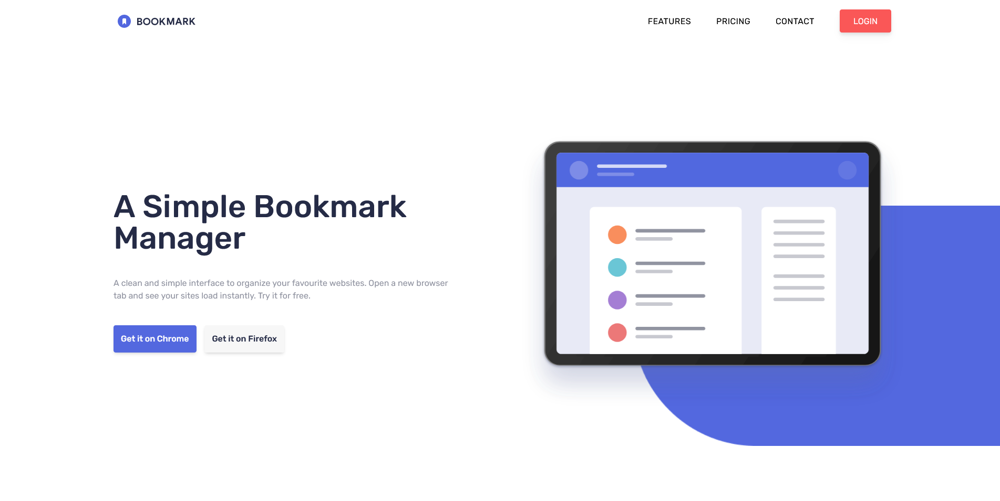

# Frontend Mentor - Bookmark Landing Page Solution :bulb:

This is a solution to the [Bookmark landing page challenge on Frontend Mentor](https://www.frontendmentor.io/challenges/bookmark-landing-page-5d0b588a9edda32581d29158). Frontend Mentor challenges help you improve your coding skills by building realistic projects.

<h2 align="center"><a href="">Visit the project page</a></h2>

## Table of contents

- [Overview](#overview)
  - [The challenge](#the-challenge)
  - [Screenshot](#screenshot)
  - [Links](#links)
- [My process](#my-process)
  - [Built with](#built-with)
  - [What I learned](#what-i-learned)
- [Author](#author)

## Overview

### The challenge

Users should be able to:

- View the optimal layout for the site depending on their device's screen size
- See hover states for all interactive elements on the page
- Receive an error message when the newsletter form is submitted if:
  - The input field is empty
  - The email address is not formatted correctly

### Screenshot

### Links

- Live Site URL: [Add live site URL here](https://henrymedeiros.github.io/bookmark/)

## My process

### Built with

- Semantic HTML5 markup
- CSS custom properties
- Flexbox
- CSS Grid
- Mobile-first workflow
- [Tailwind CSS](https://tailwindcss.com/) - For styles

### What I learned

My focus while doing this project was to pratice my layouting skills. I also used this project as my first project built with Tailwind CSS.

I learned how to use Tailwind CSS and I was impressed by how easy is to deal with the responsive layout. I also took the oportunity to implement some simple interactive features such as the tabs section, FAQ accordion and the mobile menu. I

## Author

- Website - [Henry Medeiros](https://www.henrymedeiros.dev/)
